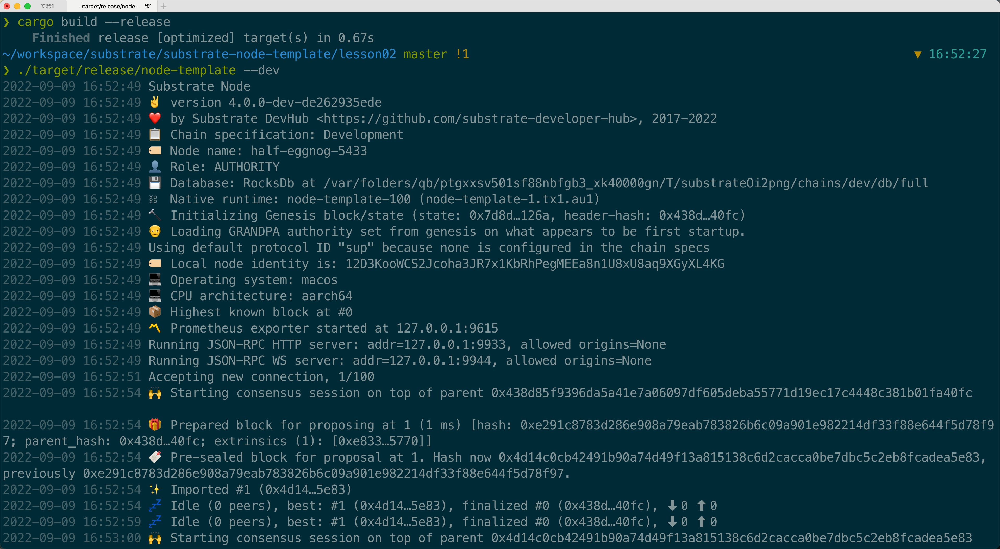

1. 完成课程中的pallet功能，在本地可以编译通过，运行。
2. KittyIndex不在pallet中指定，而是在runtime里面绑定
3. 扩展存储，能得到一个账号拥有的所有kitties
4. create和breed需要质押一定数量的token，在transfer的时候能转移质押。
5. 通过polkadot js可以成功调用pallet里面的功能

<h2 align="center"></h2>
<h2 align="center"></h2>
