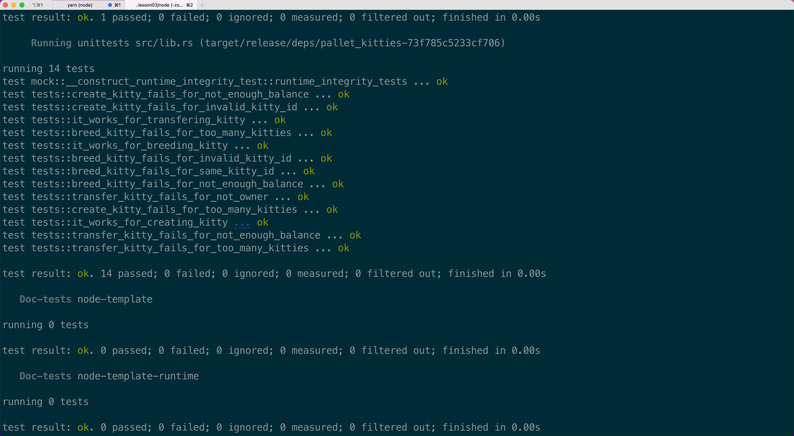

1.在 Offchain Worker 中，使用 Offchain Indexing 特性实现从链上向 Offchain Storage 中写入数据
2.使用 js sdk 从浏览器 frontend 获取到前面写入 Offchain Storage 的数据
3.回答链上随机数（如前面Kitties示例中）与链下随机数的区别
链上随机数([Randomness Module](https://docs.rs/pallet-randomness-collective-flip/3.0.0/pallet_randomness_collective_flip/))是根据当前结点的之前81个block的哈希生成的，由于链上系统无法实现真正的不可预测的熵来保证生成的随机数的随机性，所以链上随机数pallet只推荐在test时使用。
链下随机数([Offchain Random](https://docs.rs/sp-io/6.0.0/sp_io/offchain/fn.random_seed.html))由于是在链下执行，本着链下数据不可信的原则，可以使用当前结点系统关联生成不可预测的熵，以确保生成数的随机性。

4.（可选）在 Offchain Worker 中，解决向链上发起不签名请求时剩下的那个错误。参考：https://github.com/paritytech/substrate/blob/master/frame/examples/offchain-worker/src/lib.rs
5.（可选）构思一个应用场景，描述如何使用 Offchain Features 三大组件去实现它
6.（可选）如果有时间，可以实现一个上述原型

<h2 align="center"></h2>
<h2 align="center"></h2>
