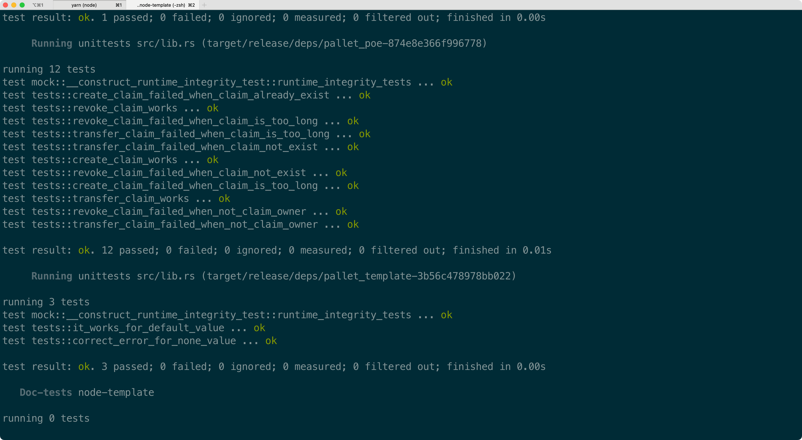

# Substrate进阶课程第六课作业

-为 proof of existence (poe) 模块的可调用函数 create_claim, revoke_claim, transfer_claim 添加 benchmark 用例，并且将 benchmark 运行的结果应用在可调用函数上；
-选择 node-template 或者其它节点程序，生成 Chain Spec 文件（两种格式都需要）；
-（附加题）根据 Chain Spec，部署公开测试网络

<h2 align="center"></h2>
